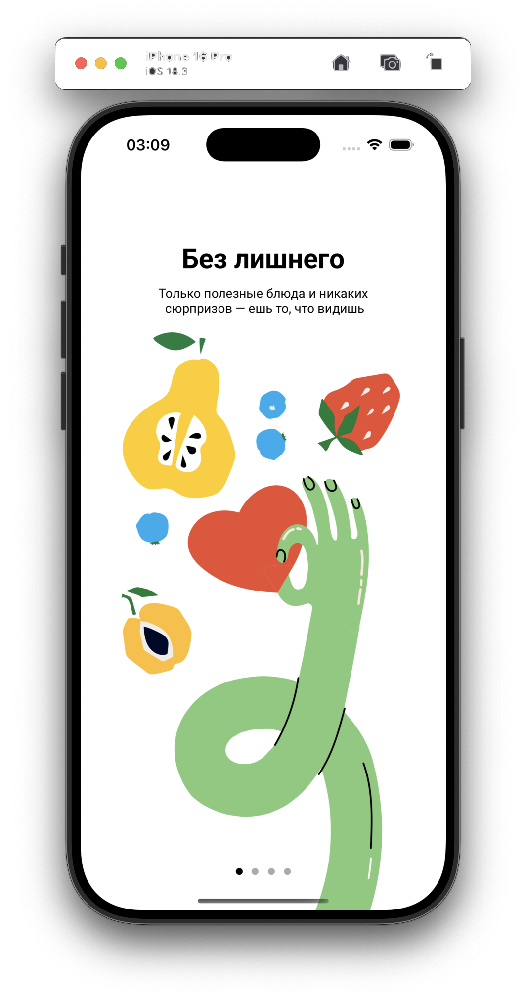

# FitoNyash 🥗

Мобильное приложение для доставки правильного питания, разработанное на Swift с использованием архитектуры MVP и паттерна Coordinator.

## 📱 Описание

FitoNyash — это iOS-приложение, которое позволяет пользователям заказывать здоровую пищу с доставкой. Приложение предоставляет удобный интерфейс для просмотра меню, добавления блюд в корзину, управления избранными товарами и оформления заказов.

## 📸 Демонстрация

### 🎥 Демо-видео
<p align="center">
  
</p>

### 📱 Скриншоты

#### Загрузочный экран
<p align="center">
  
</p>

#### Онбординг
<p align="center">
  
  
  
  
</p>

#### Аутентификация
<p align="center">
  
  
  
  
  
</p>

#### Главный экран
<p align="center">
  
  
</p>

#### Корзина
<p align="center">
  
  
  
  
</p>

#### Избранное
<p align="center">
  
</p>

#### Профиль
<p align="center">
  
</p>

---

## 🛠 Технологии и архитектура

### Язык программирования и фреймворки
- Swift 5.0
- UIKit
- Foundation

### Архитектурные паттерны
- MVP (Model-View-Presenter)
  - Разделение бизнес-логики и представления
  - Четкая структура презентеров для каждого экрана
  - Протоколы для взаимодействия между слоями

### Паттерны проектирования
- Coordinator Pattern
  - Управление навигацией
  - Изоляция логики переходов
  - Иерархия координаторов
- Factory Pattern (SceneFactory)
  - Создание экранов и их компонентов
  - Инкапсуляция логики инициализации
- Singleton Pattern (UserStorage)
  - Централизованное хранение данных
  - Управление состоянием приложения
- Observer Pattern (NotificationCenter)
  - Коммуникация между компонентами
  - Реактивное обновление UI

### Хранение данных
- UserDefaults
  - Локальное хранение пользовательских данных
  - Кэширование настроек
  - Сохранение состояния приложения

### UI/UX компоненты
- Auto Layout
  - Программная верстка интерфейса
  - Адаптивный дизайн
- Collection Views
  - Гибкая настройка отображения данных
  - Кастомные ячейки
- Table Views
  - Отображение списков
  - Динамическое обновление данных

### Тестирование
- XCTest Framework
  - Модульные тесты
  - Тестирование UI компонентов
  - Моки и стабы для изоляции тестов

### Дополнительные технологии
- Кастомные шрифты (Roboto)
- Анимации и переходы

---

## 🎯 Основные функции

- 🔐 Авторизация и регистрация пользователей
- 🏠 Главный экран с категориями и популярными блюдами
- ❤️ Добавление товаров в избранное
- 🛒 Корзина с возможностью изменения количества товаров
- 👤 Профиль пользователя
- 📱 Онбординг для новых пользователей

## 🚀 Установка

1. Клонируйте репозиторий:
```bash
git clone https://github.com/yourusername/FitoNyash.git
```

2. Откройте проект в Xcode:
```bash
cd FitoNyash
open FitoNyash.xcodeproj
```

## 📱 Требования

- iOS 13.0+
- Xcode 12.0+
- Swift 5.0+

## 🎨 UI/UX Особенности

- Современный минималистичный дизайн
- Адаптивный интерфейс
- Анимации для улучшения пользовательского опыта
- Поддержка темной темы
- Кастомные шрифты (Roboto)

## 🧪 Тестирование

Проект включает модульные тесты для основных компонентов:
- Тесты контроллеров
- Тесты презентеров
- Тесты моделей

## 👨‍💻 Автор

Никита Кочанов (tg: @rickinicki)

## 📝 Лицензия
This project is licensed under the MIT License - see the [LICENSE](LICENSE) file for details.
